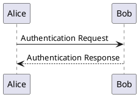

# PlantUML Project

이 프로젝트는 PlantUML을 사용하여 다양한 UML 다이어그램을 생성하기 위한 저장소입니다. 이 저장소를 통해 소프트웨어 설계 문서를 쉽게 관리하고 협업할 수 있습니다.

## 시작하기

이 섹션에서는 로컬 시스템에서 이 프로젝트를 설정하고 실행하는 방법을 안내합니다.

### 필수 조건

이 프로젝트를 사용하기 위해 다음이 필요합니다:
- Java Runtime Environment (JRE) 8 이상
- Graphviz (다이어그램 렌더링을 위함)

### 설치

1. **Java 설치:**
   - [Java 다운로드 페이지](https://www.java.com/download/)에서 JRE를 다운로드하고 설치합니다.

2. **Graphviz 설치:**
   - [Graphviz 다운로드 페이지](https://www.graphviz.org/download/)에서 Graphviz를 다운로드하고 설치합니다.
   - 설치 후 시스템의 PATH에 Graphviz 디렉토리를 추가합니다.

3. **PlantUML Jar 파일 다운로드:**
   - [PlantUML 공식 사이트](http://plantuml.com/download)에서 최신 PlantUML jar 파일을 다운로드합니다.

### 사용법

PlantUML 파일을 실행하기 위해 다음 명령을 사용할 수 있습니다:

```bash
java -jar path/to/plantuml.jar [options] path/to/diagram.puml
```

예를 들어, 저장소에 포함된 다이어그램을 생성하려면 다음과 같이 입력합니다:

```bash
java -jar path/to/plantuml.jar -tpng diagrams/
```

## 다이어그램 예제

여기에 몇 가지 다이어그램 예제를 포함할 수 있습니다. 예를 들어:



## 기여하기

이 프로젝트에 기여하고 싶으시다면, Pull Request를 보내주시거나 이슈를 등록해 주세요.

## 라이선스

이 프로젝트는 [MIT 라이선스](LICENSE) 하에 제공됩니다. 자세한 내용은 `LICENSE` 파일을 참조하세요.

---

이 README 파일은 PlantUML 프로젝트의 간단한 개요를 제공하고, 로컬 환경에서 프로저트를 시작하는 데 필요한 지침을 포함하며, 기본적인 다이어그램 예제와 기여 방법, 라이선스 정보를 제공합니다. 필요에 따라 프로젝트의 세부사항을 추가하거나 변경하여 사용하세요.